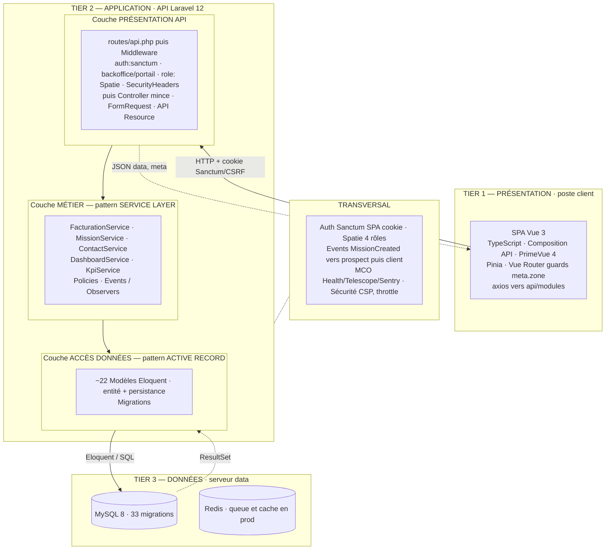

# Architecture Ledge — Schéma & paragraphe mémoire

> Document destiné au mémoire RNCP 39583 (Expert en Développement Logiciel).
> Deux livrables : le schéma d'architecture (Mermaid) et le paragraphe rédigé
> avec justification des choix.

---

## 1. Schéma d'architecture

### Légende — les 4 termes d'architecture

| Terme | Sur le schéma |
|---|---|
| **N-tier (3 tiers)** | Les blocs TIER 1 / 2 / 3 — séparation **physique** (3 process) |
| **Backend découpé en couches** | Les sous-blocs L1 / L2 / L3 **dans** le TIER 2 — séparation **logique** |
| **Service Layer** | La couche L2 **MÉTIER** |
| **Active Record** | La couche L3 **ACCÈS DONNÉES** |

### Flux d'une requête

`Vue → HTTP → Route → Middleware → Controller → FormRequest → Policy → Service
→ Eloquent → MySQL`, puis remontée `Model → API Resource → JSON → Pinia → Vue`.
Aucun niveau n'est sauté : c'est la preuve du découpage en couches.

> **Deux précisions de vocabulaire** : *un seul déployable* = monolithe (pas
> microservices) ; *tier* (séparation physique) ≠ *couche* (séparation logique
> interne au backend).

---

## 2. Paragraphe mémoire — « Architecture logicielle et justification des choix »

Ledge repose sur une **architecture N-tier à trois tiers**, assurant une
séparation physique des responsabilités : un tier de **présentation**
(application monopage Vue 3 exécutée dans le navigateur), un tier
**applicatif** (API REST Laravel 12 exposée sur le serveur) et un tier de
**données** (SGBD MySQL 8, complété par Redis pour la file d'attente et le
cache en production). Ces tiers communiquent exclusivement par contrat : le
client dialogue avec l'API en HTTP/JSON sous authentification Laravel Sanctum
en mode SPA (session par cookie et protection CSRF), tandis que l'API accède
aux données via l'ORM.

Le tier applicatif est conçu comme un **monolithe modulaire découpé en couches
logiques**. Trois couches s'y superposent, traversées dans un ordre strict et
sans court-circuit : une **couche de présentation d'API** (routage,
middlewares d'authentification, d'autorisation et de sécurité, contrôleurs
volontairement minces, validation par Form Requests, sérialisation par API
Resources) ; une **couche métier** implémentant le patron **Service Layer** —
la logique applicative est regroupée dans des services par domaine
(`FacturationService`, `MissionService`, etc.), complétés par des Policies pour
l'autorisation et par des Events/Observers assurant le découplage
inter-domaines ; enfin une **couche d'accès aux données** s'appuyant sur le
patron **Active Record** (modèles Eloquent jouant à la fois le rôle d'entité et
de mécanisme de persistance).

Deux choix structurants ont été arbitrés explicitement. D'une part, le patron
**Active Record a été préféré au patron Repository/Data Mapper** :
l'application cible un unique SGBD sans perspective de substitution, la
testabilité est déjà couverte par les outils natifs de Laravel (base recréée à
chaque test, factories), et l'ajout d'une abstraction supplémentaire au-dessus
d'Eloquent aurait constitué une sur-conception sans bénéfice mesurable
(principe YAGNI) ; le couplage entité/persistance inhérent à Active Record est
un compromis assumé. D'autre part, l'application demeure un **monolithe**
plutôt qu'une architecture microservices : la complexité opérationnelle d'un
découpage distribué (orchestration, communication réseau, cohérence
distribuée) n'est pas justifiée à l'échelle d'un cabinet, le monolithe
modulaire en couches offrant la même séparation des responsabilités sans cette
dette. Cette architecture constitue l'aboutissement d'une trajectoire
technique : d'un monolithe initial Laravel/Blade non séparé (V0) vers
l'architecture N-tier en couches actuelle (V2).
